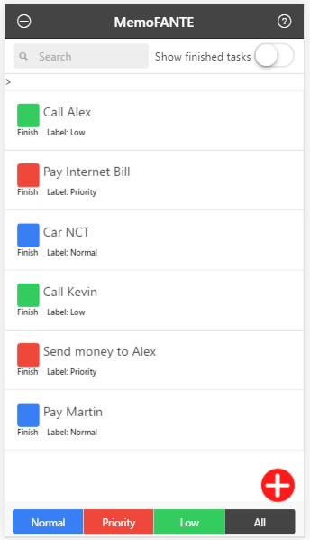
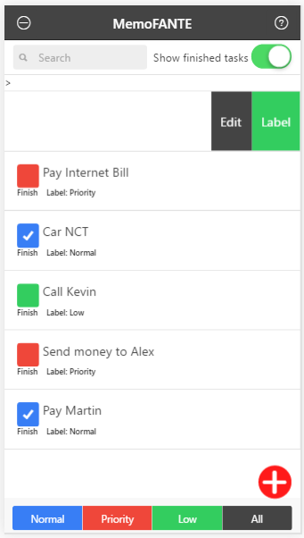
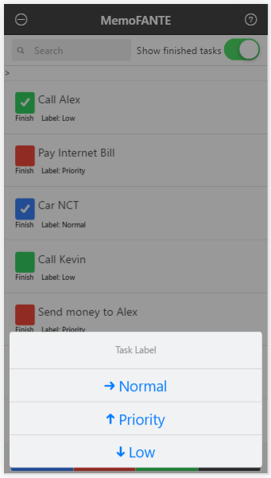
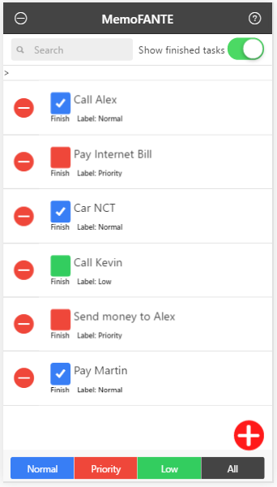

# MemoFANTE - ionic

## All tasks to be finish
 

## All tasks to be finish and finished


## Adding label to the task, them will set color for select task
### To edit or change label task, just slide the right task to the left
 

## Deleting task, tap left top corne
 

## Filter tasks by label


Hybrid mobile technologies empower a web developer to develop mobile applications which run on multiple mobile platforms. All without learning native platform languages and utilizing existing skills.

Hybrid Mobile technologies have evolved a lot and many different platforms exist.

A new Hybrid Mobile development platform to consider is Ionic.

Ionic is an advanced HTML5 Hybrid Mobile App Framework. It’s an open-source front-end framework for creating beautiful mobile applications using HTML5.

Ionic apps are based on Cordova, so Cordova utilities can be used to build, deploy and test apps. Ionic focuses on the look and feel of apps and it currently uses AngularJS to build awesome looking front-ends.


##Installation

To get started with Ionic, first make sure you have Node.js installed.

Next, depending on the app platform for which you plan to develop, install the required Android or IOS platform dependencies. 

Next, install the latest Cordova and Ionic command line tool as shown below:

```
npm install -g cordova ionic
```


## Configuration

### Installing Dependencies

After cloning the repository, run the following from your Terminal (Mac / Linux) or Command Prompt (Windows), with the project as your current working directory, to add the development platforms:

```
ionic platform add android
ionic platform add ios
```

## Usage (Android & iOS)

To build the project for Android, run the following from your Terminal or Command Prompt:

```
ionic build android
```


